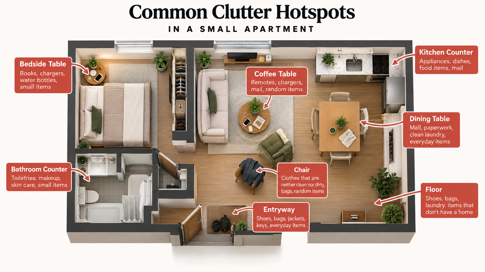
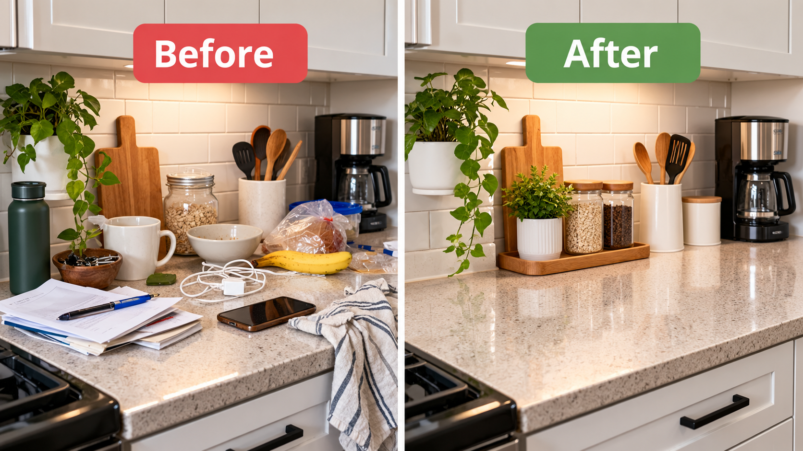
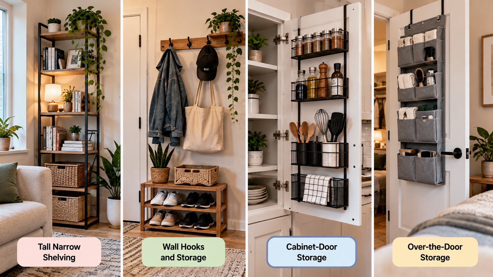
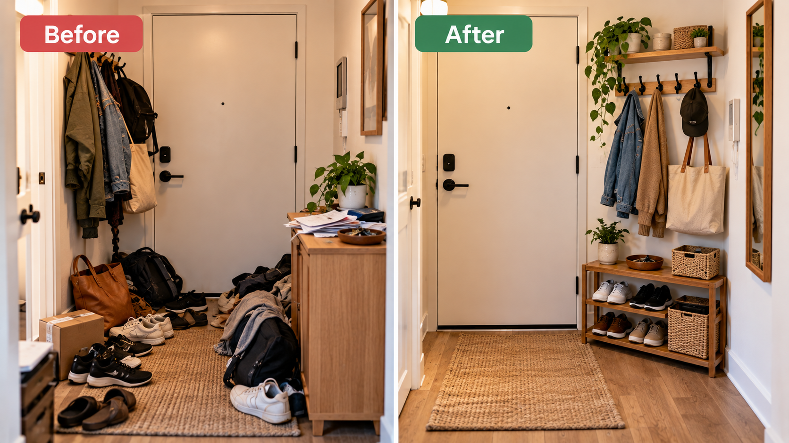
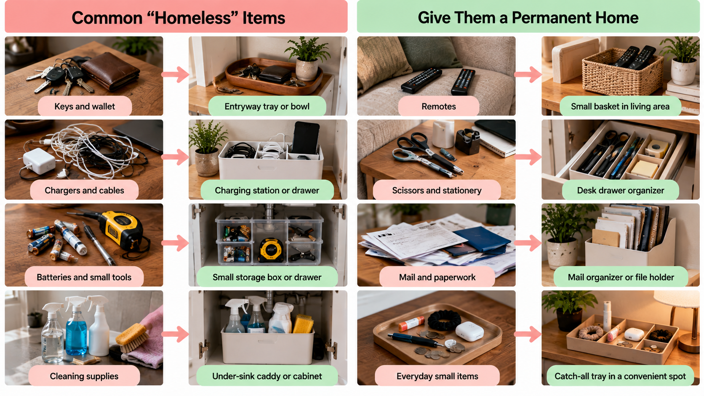
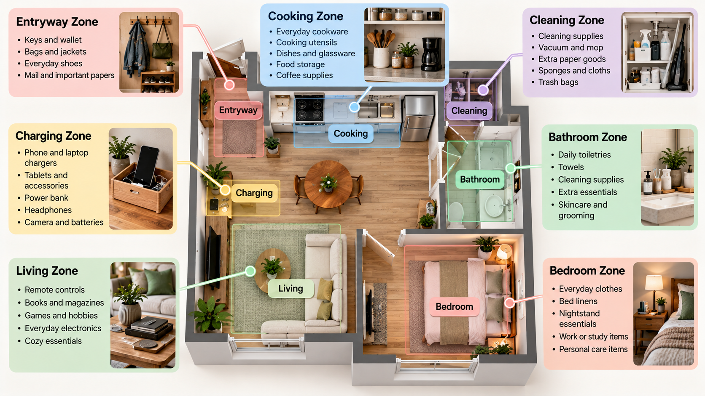
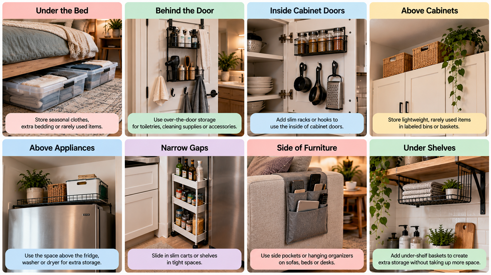
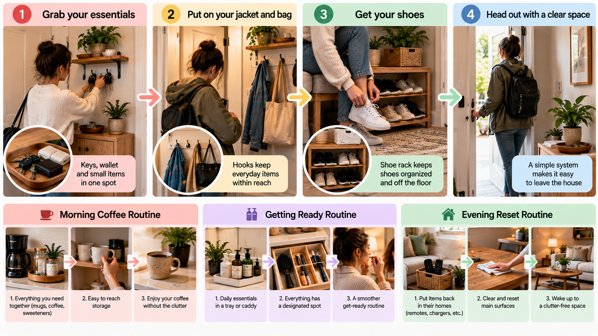

You put the mail on the counter for a second. The jacket goes over the chair because you're heading out again soon. A bag lands by the door, a charger ends up on the coffee table, and by Thursday those spots have stopped being surfaces and started being storage.

In a small apartment this happens fast, because there are so few surfaces to begin with. It's tempting to conclude that you need more storage. Sometimes you do. More often, the storage you have is in the wrong places or holding the wrong things: the closet shelf at eye level is full of items you touch twice a year, while the keys you use every day have nowhere to go.

This guide is about fixing that. It covers how to find where clutter really builds up, how to give everyday things better homes, how to use overlooked space with some restraint, and how to set things up so the apartment is easy to put back in order.

## Start by Finding Where Your Apartment Actually Gets Cluttered

Clutter in a small apartment is rarely spread evenly. It collects in a handful of spots, and they're usually the same ones every week:

- the kitchen counter and the dining table
- the floor near the door, where shoes and bags pile up
- the chair holding clothes that are neither clean nor dirty
- the bathroom counter and the bedside table
- wherever cables, chargers, and paperwork come to rest

**Recurring clutter is useful information.** If the same object keeps ending up in the same spot, there's usually a reason, and it's worth a minute to work out which:

- Its storage is too far from where you use it.
- Its storage is awkward to get into: a high shelf, a lidded box, the back of a full drawer.
- Its storage is already full.
- You use it right there, so that's where it stops.
- It has no home, so the nearest surface became one.

Each of those has a different fix, which is why it helps to diagnose before buying anything. A basket won't solve a closet that's too full, and a shoe rack won't help if the real issue is that the closet is at the other end of the apartment.

**Try this.** At the end of an ordinary day, walk through your apartment and pick the three places that get cluttered most often. Write down what's in each pile. Those three lists are your starting point for everything below.

## Give the Things You Use Every Day the Easiest Storage

Not everything you own deserves equally convenient storage. A small apartment has very little of the good kind: shelves between waist and eye level, the front of a drawer, the hook nearest the door. It makes sense to spend that on what you reach for most.

A rough sort into three groups is enough:

- **Daily:** keys, wallet, everyday shoes, coffee supplies, the pan you cook with most, your phone charger.
- **Weekly:** things that should be easy to get to but don't need the best spots, such as the vacuum, a gym bag, the bigger pots, spare towels.
- **Rare:** seasonal clothes, holiday decorations, luggage, the tools you need twice a year.

Then check where each group lives now. It's common to find them reversed. Winter coats hang at the front of the only closet in July while this week's jacket lives on a chair. The best kitchen drawer holds gadgets you rarely touch while the everyday utensils are crammed in a jar.

Swapping them costs nothing. Rare items go to the hard-to-reach spots: the top shelf, under the bed, the back of a deep cabinet. Daily items take over the easy ones.

This isn't a law. What counts as daily depends on your routine, and what counts as easy storage depends on your apartment. Someone who cycles to work may need a helmet by the door more than an umbrella. The point is only that convenience is limited, so it should go to what you use.

## Stop Letting Flat Surfaces Become Storage

Counters, tables, desks, and nightstands are where a small apartment does its living. They're also the easiest place to put something down. When every surface is half covered, there's nowhere to cook, eat, or work without moving a pile first.

Take one surface at a time and sort what's on it three ways:

**Keep.** Things used right there, often. The kettle on the kitchen counter. A lamp, a book, and a glass of water on the bedside table. Hand soap and a toothbrush at the bathroom sink.

**Relocate.** Things that have a home somewhere else and haven't made it back: the mug on the desk, clean laundry on the dining table, scissors on the coffee table.

**Remove.** Things sitting there because they have nowhere to go. Mail, receipts, a package to return, spare cables. These are your homeless items, and a later section deals with them.

The aim isn't bare surfaces. An empty counter in an apartment where someone cooks every day would be less useful, not more. The aim is that each surface holds a few things on purpose and can still do its job. A dining table with a small tray for mail at one end and room to eat at the other is doing fine.

## Use Vertical Space Before Taking Up More Floor Space

In many small apartments, floor space is the scarcest thing, and each piece of furniture you add makes the room a little harder to move through. Walls and height are usually less contested. So when you do need more storage, look up first.

Where it tends to help:

- **A tall, narrow shelf instead of a low, wide one.** The same footprint or less, with more shelves.
- **Hooks.** Behind a door, inside a closet, beside the entry. They hold bags, jackets, towels, and headphones with no furniture at all.
- **Wall-mounted shelves or rails** above a desk, over the toilet, or beside the bed in place of a nightstand.
- **The inside of cabinet and closet doors,** for a slim rack or a few hooks, as long as the door still closes.
- **High shelves** for the rare group: luggage, seasonal bedding, things you fetch a few times a year.
- **A pegboard,** if you have a real collection of small tools or supplies and a wall that can take it.

A few cautions keep this from backfiring. Anything you use daily should stay within comfortable reach, because if it needs a step stool you'll stop putting it back. In a rental, check what your lease allows before drilling, and think about what the wall is made of and how much weight it will carry. Adhesive hooks avoid holes, but they have weight limits and don't hold on every surface. Over-the-door racks don't fit every door, and some keep it from closing properly. Tall freestanding shelves may need to be secured so they can't tip.

None of this means covering every wall. Open storage at eye level is always on display, and a room lined with loaded shelves can feel smaller. Use vertical space when it solves a real storage problem, such as one of your three hotspots, and leave the other walls alone.

## Make the Entryway Work Harder

Many small apartments don't have an entryway so much as a door that opens into the living room. That's fine. What matters is the patch of wall and floor just inside the door, because everything that leaves with you and comes back with you passes through it.

The list is short: keys, bag, shoes, jacket, and depending on the day, an umbrella, the mail, and reusable shopping bags. Each needs one predictable place.

- **Keys** get a hook or a small catch-all tray, in the same spot every time.
- **Your everyday bag** gets one hook or one spot on a shelf. One bag, not all of them.
- **Jackets** get two or three hooks for what's in current use. The rest live in a closet.
- **Shoes** get a narrow rack or a tray, sized for the pairs you're wearing this week.
- **Mail** gets one small wall pocket or tray, emptied regularly, so it stops at the door instead of travelling to the table.
- **Reusable bags** can hang on a hook, folded inside one of their own.

The limit matters as much as the homes. An entry asked to hold every shoe and coat you own will overflow. Keep the current season by the door and rotate the rest to a closet or under the bed.

Resist building something elaborate here. A tiny entrance doesn't need a bench, a cabinet, a mirror, and a labeled basket per person. A few hooks, a tray, and a place for shoes is enough for many households.

## Give “Homeless” Items a Permanent Home

Most apartments have a population of small things that drift: chargers, remotes, scissors, batteries, tape, a screwdriver, spare keys, the manual for something. None of them is a problem alone. Together they're most of what ends up on your surfaces.

A simple test picks them out. Hold the item and ask: **“If I needed this tomorrow, where would I look first?”**

If you have an immediate answer, put it there. That's its home, even if it isn't where an organizing guide would put it. If you'd have to check three places, it doesn't have one yet.

Giving these things homes doesn't mean a separate container for each. That produces a dozen tiny boxes and a system nobody keeps up. Group them loosely by what they're for:

- chargers, cables, and adapters in one pouch or box
- batteries, tape, scissors, and a few basic tools in one fix-it drawer or box
- remotes in one tray or basket
- manuals, warranties, and papers you have to keep in one folder
- cleaning cloths, sprays, and sponges in one caddy

Four or five groups is usually enough to absorb most of the drift. Keep each in something easy to open, because an open box on a shelf gets used and a lidded bin under three other bins doesn't. Where each group should live is the next question.

## Use Small Storage Zones Instead of One Giant Storage Area

When storage is scarce, it's tempting to put everything spare in one place: the hall closet, a big cabinet, the drawer that holds everything. In practice, every small job, from changing a battery to wiping the counter, starts with a trip to the same overloaded spot and a dig through unrelated things.

For things in regular use, several small zones usually work better than one large one, even when that splits a category across two places. The principle is to **store things near the point of use**:

- a charging spot by the sofa or bed, where devices get used
- cleaning supplies split between kitchen and bathroom, if you clean both
- cooking tools by the stove
- keys and bags at the door
- everyday toiletries at the bathroom sink, with backups elsewhere

The benefit shows up when you're putting things away. If an item's home is two steps from where you finish using it, it goes back. If it's across the apartment, it waits on a surface for later. Shortening that distance tends to do more for a tidy apartment than resolve does.

A central spot still makes sense for bulk, backups, and anything used rarely. Zones are for what's in use.

## Don’t Ignore Awkward and Overlooked Spaces

Most apartments have a few places that hold nothing because nobody thought of them as storage. A quick survey is worth doing:

- **Behind doors.** Over-the-door hooks or a slim rack for towels, robes, bags, or cleaning tools.
- **Inside cabinet doors.** Lids, wraps, a hair dryer, or cleaning gloves on hooks or shallow racks.
- **Under furniture.** Low bins under the bed for off-season clothes and spare bedding. Under the sofa too, if there's clearance.
- **Above wardrobes and cabinets.** Closed boxes for the rare group.
- **Above appliances.** A shelf over the washing machine or fridge, where there's room and it doesn't block vents.
- **Narrow gaps.** Beside the fridge or between furniture and the wall, for a slim cart or flat items stored on edge, if you can reach in.
- **Sides of cabinets and bookcases.** A hook or two for a tote, headphones, or an apron.
- **Under shelves.** Hooks or a hanging basket use the air below a shelf.
- **Corners and short wall sections.** A corner shelf or a single rail fits where furniture won't.

Now the caveat, and it matters. Not every empty spot should become storage. Empty space does work in a small apartment: a clear stretch of wall, a bare corner, and open floor are what make the place feel calm and easy to move through. Fill all of it and you've traded clutter on the surfaces for clutter on the walls.

So use an overlooked space when it fixes something on your hotspot list. Shoes piling up by the door might justify a rack behind it. If nothing needs the gap beside the fridge, leave it empty.

## Organize Your Apartment Around Your Routines, Not Just Your Rooms

A lot of organizing advice goes room by room: kitchen, bedroom, bathroom. That's a sensible way to sort possessions. It isn't how a day goes. You live through routines, and a routine is a sequence of actions that doesn't care which room an item was assigned to.

Zones settle where things are kept. Routines ask what order you reach for them in, and how much walking back and forth that order involves. Look at a few of yours step by step.

**Leaving the apartment.** Keys, wallet, phone, shoes, bag, jacket. If those are in four places, leaving takes four stops, and one of them is usually a search. Gathered by the door, it's one.

**Making coffee.** Coffee, filters, mugs, a spoon, the machine. Put them on the same shelf or in the cabinet beside the machine, and the morning needs one door instead of three.

**Getting ready.** Clothes, toiletries, and the accessories you wear every day. In a studio these may be split between a closet, the bathroom, and a dresser top. Notice which one makes you double back.

**Cleaning.** Sprays, cloths, the vacuum, bin bags. If wiping down the bathroom means collecting supplies from three places, it gets put off.

For each routine the question is the same: where in the sequence do you backtrack, cross the room, or hunt? That's the friction, and it's often fixed by moving two or three items, not by reorganizing a room. The mugs move next to the coffee maker. The sunglasses move from the bedroom to the tray by the door. A second set of cloths goes under the bathroom sink.

You don't need to map your whole life this way. Pick the routine that feels clumsiest and smooth that one out. It's fine for the result to cut across rooms. A gym bag can live by the door even though it's full of clothes, because the door is where it's needed.

## Make the Apartment Easier to Reset

Any apartment gets messy over the course of a day. What differs is how long it takes to put right. In a setup that works, a reset is a few minutes of returning things to where they obviously go. In one that doesn't, it's a long session of deciding where things should go.

A few things keep resets short:

- **Obvious homes.** Anyone who lives there could guess where the scissors go.
- **Storage with slack.** A drawer filled to the top is hard to put things back into, so things don't go back. Leaving some room is part of the system.
- **Easy access for everyday things.** No lids, no stacking, no step stools for the daily group.
- **A short, regular reset.** A few minutes each evening suits some people, a longer pass twice a week suits others. Choose a rhythm you'll keep, and don't turn it into a schedule.

When a reset keeps snagging on the same pile, read it the way the first section suggests, as feedback. **A system that requires constant effort is probably the wrong system.** Move the home, simplify the category, or free up the storage, then see if the pile comes back.

What you're after is an apartment that asks fewer decisions of you. It doesn't have to be perfect.

## Small Apartment Organization Mistakes to Avoid

**Buying storage before measuring.** A shelf slightly too wide for the alcove, or a bin too tall to slide under the bed, is worse than nothing, because now you have to store it. Measure the spot, including door swings and baseboards, and know what will go in it before you buy.

**Using prime storage for rarely used items.** This one is easy to miss because the storage looks full and tidy. The cost shows up elsewhere, as everyday things with nowhere to go. If a surface keeps filling up, check what's occupying the nearest easy shelf.

**Filling every empty space.** Storage packed solid is hard to use, and an apartment with no open floor or bare wall can feel cramped however organized it is. Some emptiness is doing a job.

**Creating complicated systems.** Color-coding, many small labeled containers, and strict folding methods can work for people who enjoy them. They also tend to be the first thing abandoned in a busy week. A useful rule of thumb: if putting something away keeps feeling like a chore, the system is asking too much.

**Organizing only for appearance.** Matching baskets and clear counters look good in a photo. If the setup hides things you need daily, or takes work to keep photo-ready, convenience usually wins and the clutter comes back.

**Ignoring how you actually live.** A desk you never work at doesn't have to stay a desk. If your bag always lands on the sofa, a hook beside the sofa may serve you better than one by the door. Build around what you do, not what you think you should do.

## A Simple Small-Apartment Reset You Can Do This Weekend

This is a trial, not an overhaul. You are not reorganizing the whole apartment in two days. You're testing a handful of changes to see what sticks, and you don't need to buy anything to do it.

1. **Pick three clutter hotspots.** Use the list from your walk-through. Leave everything else alone for now.
2. **Remove obvious trash and items that belong elsewhere.** Recycle the junk mail and packaging, and return anything with a known home. What's left is the real problem.
3. **Identify the homeless items.** Apply the “where would I look first?” test to what remains, and sort it into four or five loose groups.
4. **Reassign prime storage.** Near each hotspot, find the most convenient shelf, drawer, or hook. If it's holding rarely used things, move them to a harder spot and give the space to the daily items that were causing the pile.
5. **Use one overlooked space.** Just one, chosen because it solves something on your list: hooks behind a door, a bin under the bed, the inside of a cabinet door.
6. **Create one routine-based zone.** Take your clumsiest routine and gather its items in one place. The leaving-the-house spot by the door is a good first choice.
7. **Live with the system before buying organizers.** Use a shoebox, a jar, or a tray you already own as a stand-in. After a week or two you'll know which changes held. Then, if a spot needs a proper hook, shelf, or container, you can buy one for a setup that has already proven itself.

An organizer bought for a system that doesn't work is one more thing to store.

## Quick Small-Apartment Organization Checklist

- Identify the three biggest clutter hotspots.
- Give daily-use items the easiest storage.
- Clear unnecessary surface clutter.
- Use vertical space where appropriate.
- Create homes for homeless items.
- Store things near where they are used.
- Use one overlooked storage area.
- Move rarely used items away from prime storage.
- Avoid overcomplicated systems.
- Test the setup before buying organizers.

## Frequently Asked Questions

### How do I organize a small apartment with very little storage?

First make sure the storage you have is holding the right things. Move rarely used items to the least convenient spots you have: a high shelf, under the bed, or the back of a deep closet. Then add storage upward and behind doors before adding furniture that takes floor space.

### How can I make a small apartment feel less cluttered?

Clear the surfaces you see first when you walk in, and keep some floor and wall visibly empty. Closed storage tends to look calmer than open shelves, so put the visually busy things, such as cables, toiletries, and paperwork, behind a door or in a box.

### Where should I put things in a small apartment?

As close as you can to where you use them, with the most convenient spots going to what you use most. If you're unsure about an item, notice where it ends up when you aren't thinking about it. That's usually near where it should live.

### How do you organize a small apartment without buying lots of organizers?

You can do most of it without any. The improvement comes mainly from decisions: what gets the easy storage, what moves out of the way, and where each loose item lives. When a container would help, start with a box or jar you already own, and buy something only once a specific spot has shown it needs it.

### What should I do when everything seems to have a place but the apartment still feels messy?

Check three things. The places may be inconvenient, so things have homes but don't get returned to them. The storage may be too full to put things back easily. Or there may be too much on display, since open shelves and hooks can be organized and still look busy. Moving some of it behind doors, or thinning what's out, often changes the feel more than reorganizing again.

## An Apartment That’s Easier to Live In

A small apartment doesn't have to become minimalist to work well. You can own books, hobbies, and more than two mugs. The improvements that matter most are quieter than that: fewer things without a home, storage in more useful places, routines that take fewer steps, and better use of the space you already have.

If the kitchen turned out to be one of your three hotspots, *Small Kitchen Organization Ideas That Actually Free Up Space* is the place to go next. It takes the same approach to counters, cabinets, and drawers.

The goal was never to fill every empty corner. It's an apartment where things are easy to find and easy to put back, and where an ordinary day leaves less to clean up.
