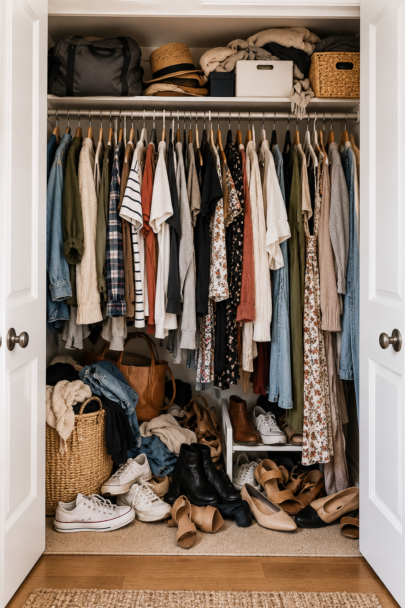
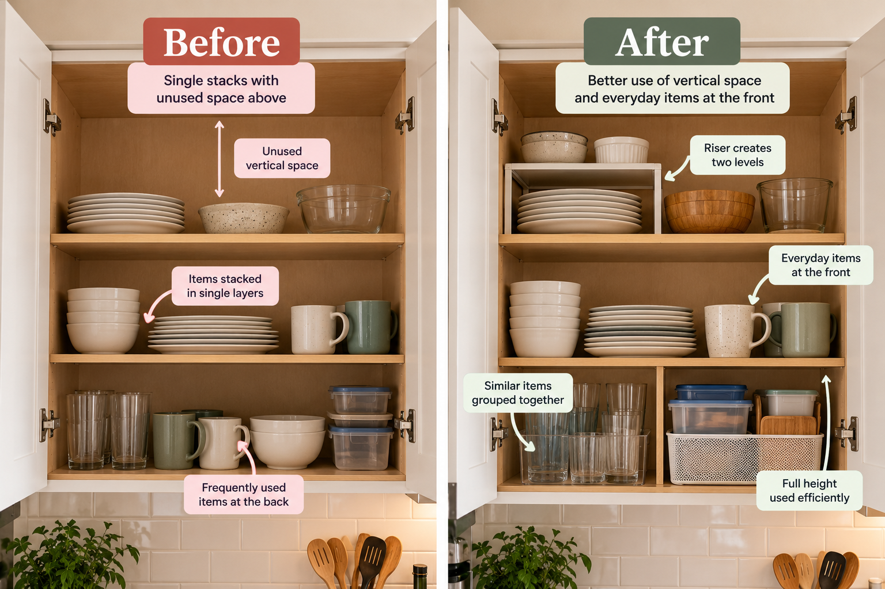
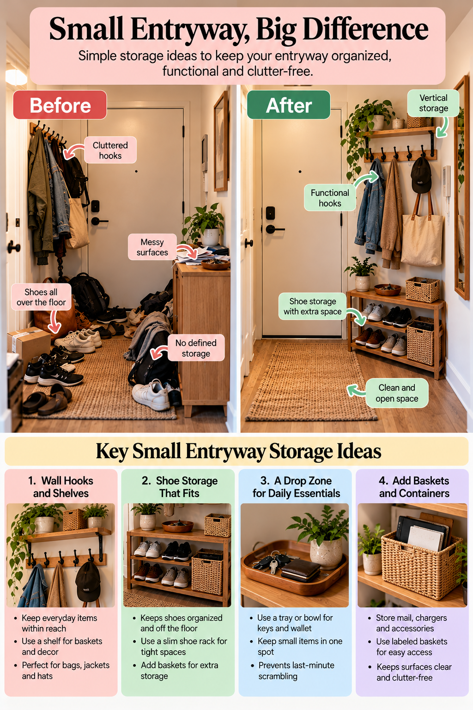
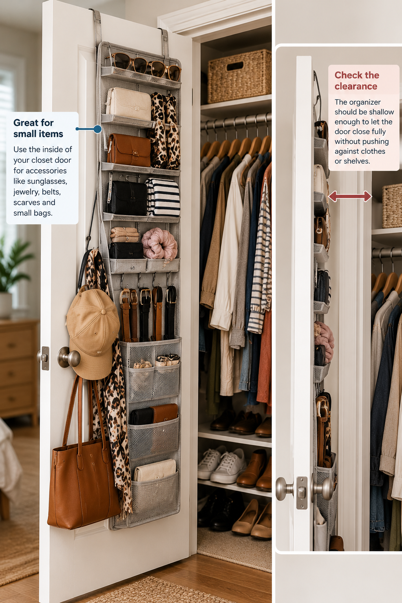
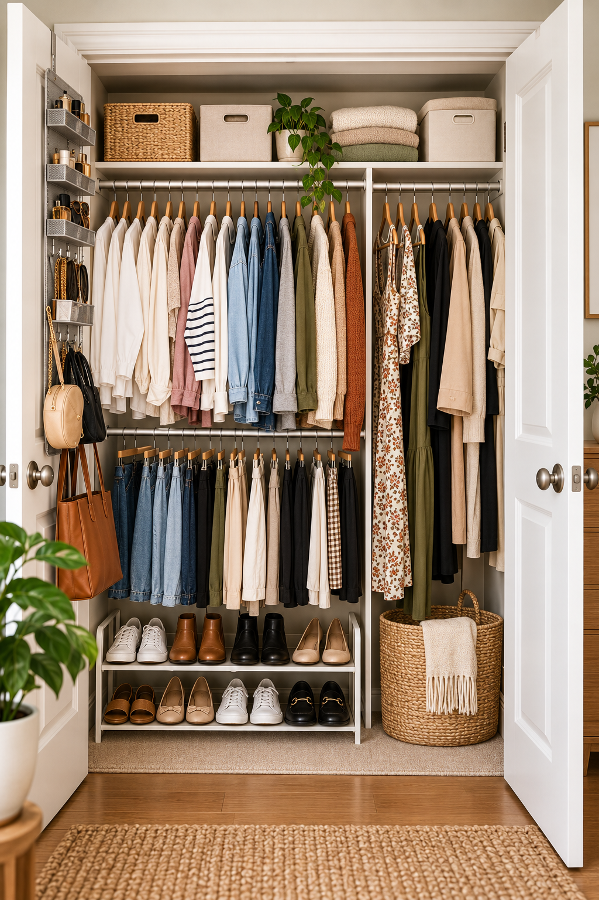

The rod is so full that pulling out one shirt drags two others with it. Shoes cover the floor in a loose heap. The shelf above holds a duffel bag, a hat, some spare bedding, and a box nobody has opened since it went up there.

The closet isn't big, but that's only part of the trouble. A good share of it is empty air, and much of the rest is doing the wrong job. That's worth knowing before you decide you need a bigger closet, a renovation, or a cart full of organizers.

This guide will help you see where the space is going, choose fixes that suit your particular closet, keep everyday clothes easy to reach, and avoid organizers that take up more room than they give back.

## Start by Figuring Out What's Wasting Space

Small closets get crowded in a few predictable ways, and each one points to a different fix. Stand in front of yours with the door open and see which of these you recognize.

| What you notice | What to try first |
| --- | --- |
| Packed rod, with empty space under the shorter clothes | A second hanging level (Idea 1) |
| Packed rod, mostly long garments | Fold what doesn't need to hang, then regroup what's left |
| A jumbled upper shelf | Categories in containers that fit (Idea 2) |
| Folded stacks that topple | Shorter stacks and dividers (Idea 4) |
| Shoes and bags across the floor | A low rack and a set place for bags (Ideas 6 and 8) |
| Rarely worn things in the easiest spots | Move them higher or elsewhere (Idea 9) |
| Everyday clothes that are hard to get to | Rearrange by how you get dressed (Idea 10) |
| An organizer that gets in the way | Take it out for a week and see what you miss |

The reason to diagnose first is that solutions don't transfer. A second hanging level works well under short garments and does nothing for a closet full of long dresses. More bins help with loose items and won't fix a shelf that's too shallow to hold them. And an organizer that blocks what's behind it, or takes up the room it was supposed to save, leaves you worse off than before.

Once you know which problem you're solving, measure that part of the closet before buying anything for it: width, depth, and height, plus the drop below the rod and the way the door swings or slides if either is involved.

*Illustrative example: the storage changes shown may not fit every closet.*

## 10 Small Closet Organization Ideas That Create More Usable Storage

You won't need all ten. Pick the ones that match what you found above.

### 1. Add a Second Hanging Level Where the Clothes Allow It

Shirts, blouses, skirts, and trousers folded over a hanger stop well short of the floor, which leaves a band of empty space beneath them. A second rod in that band gives those pieces another row.

To set it up, group your short garments at one end of the rod, then measure from the bottom of the longest one to the floor. The lower row has to fit in that height, with room to lift hangers on and off.

There are three ways to add the row, and they aren't interchangeable. A hanging extender hooks onto the existing rod and puts the lower row's weight on it, so it relies on that rod and its brackets being sound. A tension rod presses between the two side walls, which need to be solid and the right distance apart, and many are intended for light loads. A low freestanding rail carries its own weight but takes floor space. Whichever you use, go by the manufacturer's stated capacity.

Long dresses, coats, and jumpsuits need the full drop, so keep part of the closet single-height for them.

### 2. Turn the Upper Shelf Into Intentional Storage

The top shelf tends to collect whatever didn't fit anywhere else. It works better with a short list of jobs: out-of-season accessories, occasional-wear pieces, spare linens, a travel bag.

Give each category one container, and choose containers by the shelf's measurements, not by how they look in a shop. They should fit the depth without overhanging and leave enough height to lift them out. Label them, or use ones you can see into, since you'll be looking at them from below.

Put what you reach for most at the front edge, on the side you can reach best. Keep heavy items off this shelf, because lifting weight down from above your head is awkward and risky. If there's room left over after that, leave it. An upper shelf with some breathing space is easier to use than one packed to the ceiling.

### 3. Use Consistent, Space-Conscious Hangers

A rod hung with a mix of thick plastic, wire, and wooden hangers can feel more crowded than it needs to. The hangers sit at different heights and widths, and the bulkier ones take up some of the rod for themselves.

Switching everyday shirts, tops, and dresses to one slim style may let the same clothes sit a little closer together and hang more evenly. How much it helps depends on what you own and on the hanger itself, and a new set of hangers won't rescue a rod that simply holds too much.

Slim isn't right for everything. Structured pieces such as tailored jackets and heavy coats generally need a hanger with more support, and some knits are better folded than hung. If a garment's care label says how to store it, follow that.

### 4. Divide Shelves So Folded Clothes Stay in Place

Folded clothes tend to fall over for two reasons: the stack is too tall, or it has nothing beside it to lean on. Both are fixable.

Keep stacks short enough that you can pull out the bottom item with one hand while steadying the rest. On many shelves that means splitting one tall pile into two. Then group by category, such as T-shirts, sweaters, and jeans, so each stack has a clear identity and things go back where they came from.

Shelf dividers give each stack a wall. They help most on long, open shelves. They help less on a shelf that's too shallow for the folded item, since the stack will hang over the edge with or without them. Some clip-on styles only fit certain shelf thicknesses, so check yours.

The aim is being able to take out one sweater without rebuilding the pile. Neat edges are a bonus.

### 5. Use the Inside of the Closet Door

On a hinged door, the inside face is storage that needs no floor or shelf space. It suits flat, light things: scarves, belts, ties, jewelry, hats, a few small bags.

It only works if the door still closes. Before choosing an organizer, check the gap between the closed door and whatever is behind it, such as shelf fronts or hanging clothes. Compare that with the organizer's depth once it's loaded. Look at where the hinges sit, too.

Then consider how it attaches. Over-the-door hooks need a door thin enough for the hook and enough clearance at the top of the frame. Adhesive hooks depend on the door's surface and the weight you hang, and they can mark some finishes when removed. A screw-mounted organizer is the most secure on a solid door, but not every door takes screws well, and a rental may not allow them.

Sliding and bifold doors mostly rule this idea out. If that's your closet, move on to the next one.

### 6. Make the Closet Floor Work Harder

A closet floor covered in loose shoes holds fewer pairs than it could, and you can't see half of them. A low shoe rack adds a second tier in the same footprint. Alongside it, one or two defined containers are plenty, for example a basket for gym gear.

What matters here is the height from the floor to the hems above. A rack has to fit under the clothes without them resting on the shoes, and under long garments there may be no room at all, in which case that stretch of floor is better left clear.

Stay low. Tall storage on the floor can block long clothes, stop a door from closing, or make it impossible to open a drawer unit beside it. Leave yourself a way to reach the back as well. If you'd have to move a rack to get to something, one of the two is in the wrong place.

### 7. Add Vertical Compartments to a Hanging Section

A hanging shelf organizer is a fabric column of cubbies that hooks over the rod. It's a quick way to get shelves into a closet that has none, and it suits folded sweaters, T-shirts, bags, or shoes.

The trade-off is that it takes rod width, and the full height below it. It converts hanging space into shelf space and adds none of its own. If your rod is already tight, giving up a section to cubbies may leave you worse off. It makes sense when you have more folded items than places to put them and can spare the hanging room, perhaps after freeing some up with a second hanging level.

Compare the alternatives before choosing. If you already have shelves, dividers organize them without using any rod. If you have floor space and no shelves, a narrow freestanding unit is generally sturdier and holds more. The hanging organizer is the better choice when you can't add furniture and need shelves in the hanging zone. Check its stated weight limit, since the load goes on your rod.

### 8. Give Bags and Accessories Their Own Home

Bags, belts, scarves, and hats are the things most likely to end up in a pile, because they don't hang or fold the way clothes do. What they need is one defined zone, wherever it fits: the back of the door, three hooks on a side wall, a narrow section of shelf, or a single bin.

Hooks suit everyday bags and belts. Place them where they won't snag hanging clothes or stop a door from closing. The side walls near the front of a reach-in closet are often free. If you can't mount anything, as in many rentals, hooks that hang from the rod or a shelf edge do a similar job without fixings.

How a bag is best stored depends on how it's made. Soft totes and everyday bags are usually fine on a hook. A structured bag may hold its shape better standing on a shelf than hanging by its straps for long periods, so follow the maker's advice if you have it. Small accessories do well in a shallow tray or divided box, where everything is visible at once.

### 9. Store Seasonal and Occasional-Use Items Elsewhere, or Higher

The most accessible part of a closet is the front, between about knee and eye level. A small closet doesn't have much of it, so anything living there that you wear twice a year is costing you.

Heavy coats in summer, formal wear, ski gear, and spare bedding are the usual candidates, and there are two ways to deal with them. If you have suitable storage outside the closet, such as a low container under the bed or a cupboard in another room, moving them out frees the most space. Label what goes, so finding the winter scarves doesn't mean opening four boxes.

If you don't, they stay in the closet and trade places: out of the prime section and onto the upper shelf (light items only), the far ends of the rod, or the back of a shelf. That gains no space, but the part of the closet you use every day gets easier to use.

### 10. Reorganize by How You Actually Get Dressed

The last idea costs nothing and affects every morning. Arrange the closet around what you reach for, in the order you reach for it.

Start with what you wear most. If that's workwear on weekdays, give it the easiest section of the rod, front and center, at a comfortable height. Keep the pieces you combine near each other: trousers beside the shirts you wear with them, gym clothes together in one spot.

A simple test is to think through getting dressed on an ordinary day and notice each time you'd have to dig, reach past something, or go to a second location. Those are the things to move.

This arrangement won't look like a color-sorted closet in a photo, and it doesn't need to. A layout built around how you get dressed tends to hold up better than one built to look good.

## Small Closet Solutions for Renters and Awkward Layouts

Some closets come with constraints that general advice skips over. This is how the ideas above change for four common ones.

### If You Can't Drill Into the Walls

Start with what's already fixed in place: the rod, the shelf, the door. Hanging rod extenders, hanging shelf organizers, and hooks that loop over the rod or a shelf all work from existing fittings (Ideas 1, 7, and 8). Freestanding pieces, such as a low shoe rack or a narrow shelf unit, need no installation at all.

Over-the-door and adhesive options can fill gaps, with caveats. They generally carry less than fixed fittings, they can shift or sag when overloaded, and they don't fit every door or surface. No removable product is guaranteed to leave no trace, so check the manufacturer's guidance and your lease, and test somewhere that doesn't show.

### If Your Closet Is Shallow

A shallow closet punishes anything bulky. Hangers may already sit close to the door, so door-mounted organizers and deep bins often won't fit.

Measure the usable depth from the back wall to the inside of the closed door, and buy to that number, not to how compact something looks in a photo. Favor flat solutions: slim hangers, shelf dividers, hooks on the side walls, a single-tier shoe rack. If the door only just closes on the hanging clothes, leave the door bare.

### If Your Closet Has No Built-In Shelves

With a rod and nothing else, shelf space has to come from one of three places: the rod itself, in the form of a hanging shelf organizer with the trade-off described in Idea 7; the floor, with a freestanding unit; or containers on any stable surface that's already there.

A freestanding unit has to fit the footprint with the door closed, sit below or beside the hanging clothes, and still leave you room to reach the rod on either side of it.

### If Hanging Clothes Take Up Almost All the Space

Look at the lengths first. If most of what hangs is short, a second level (Idea 1) may open up a lot of room. If most of it is long, such as dresses, coats, and long skirts, a second rod will make hems bunch or drag, and it isn't the answer.

For a long-garment closet, work on what's hanging. Fold what can be folded, such as knitwear and jeans. Move occasional pieces to other storage if you have it. Group what remains by how often you wear it, so the daily items aren't trapped between formal ones. Sometimes the useful change is fewer things on the rod, not more hardware around it.

## How to Keep a Small Closet Organized

A small closet has no slack to hide drift in, so a few habits that take seconds are worth having. None of them is a schedule.

1. **Put things back in their category.** Sweaters go with sweaters, even when it's late.
2. **Keep everyday clothes in the easy spots.** If rarely worn pieces creep into the front section, move them back out.
3. **Protect the floor and the door.** A clear floor and a door that closes freely are usually the first things to go.
4. **Decide where something new will live before it goes in.** If there's no obvious place, something may need to shift to make one.
5. **Reassess when the season or your routine changes.** Swap what's in the prime section when the weather turns, or when a new job changes what you wear.

If keeping it up starts to feel like work, or the same things keep landing in the wrong place, treat that as a sign that the layout needs adjusting. The answer shouldn't be to try harder.

## Small Closet Organization FAQs

### How do you organize a very small closet with lots of clothes?

Work out what's taking the most room, hanging or folded clothes, and where the squeeze is: the rod, the shelf, or the floor. Fix that one bottleneck first. Then move anything you rarely wear out of the easiest-to-reach spots, to higher or more awkward storage, or to another part of your home if you have somewhere suitable.

### How can you create more closet storage without drilling holes?

Use what's already installed. The existing rod can carry a second hanging level or a hanging shelf organizer, within its capacity, and the floor can take a low rack or a narrow freestanding unit. Over-the-door and removable hooks add a little more, provided they fit your door, suit the surface, and aren't asked to hold more than they're made for.

### How do you make a small closet work without shelves?

Add shelf-like storage in whichever form fits: a hanging organizer if you can spare rod width, a freestanding unit if you have floor area, or containers on the floor or another stable surface. Sweaters, T-shirts, and other things that fold well can move there, leaving the rod for what needs to hang.

### What should go on the top shelf of a small closet?

Light things you need occasionally: out-of-season accessories, spare bedding, a travel bag, special-occasion shoes in a box. Keep heavy items and anything you use weekly lower down, and make sure you have a safe way to reach the shelf.

### How do you organize a small closet with long clothes?

Keep a full-height hanging section for them, and don't add a second rod beneath, since hems will bunch or touch the floor. Put the effort into the other zones: the upper shelf, the door if it's hinged, and the floor to either side. Folding what doesn't need to hang leaves more of the rod for the long pieces.

## One Area at a Time

A small closet works better when each part of it has a job, the clothes you wear most are the easiest to reach, and anything you add is there to solve a specific problem. That's a different goal from fitting in as much as possible, and it usually takes fewer products.

For a next step, pick the most crowded area, measure it, and make one change there. Live with it for a week or two before buying organizers for the rest of the closet.

If the closet is one of several tight spots at home, our guide [Small Apartment Organization Ideas That Actually Make a Difference](/articles/small-apartment-organization/) takes the same approach room by room.

---
