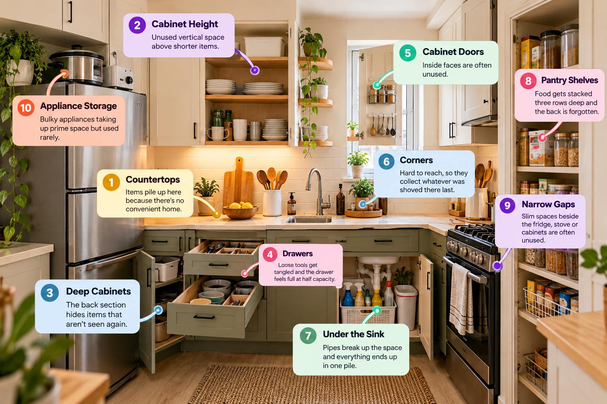
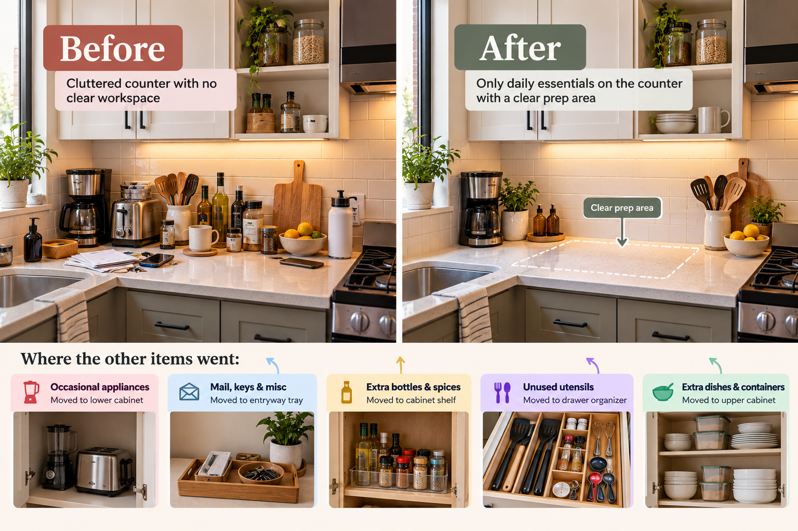
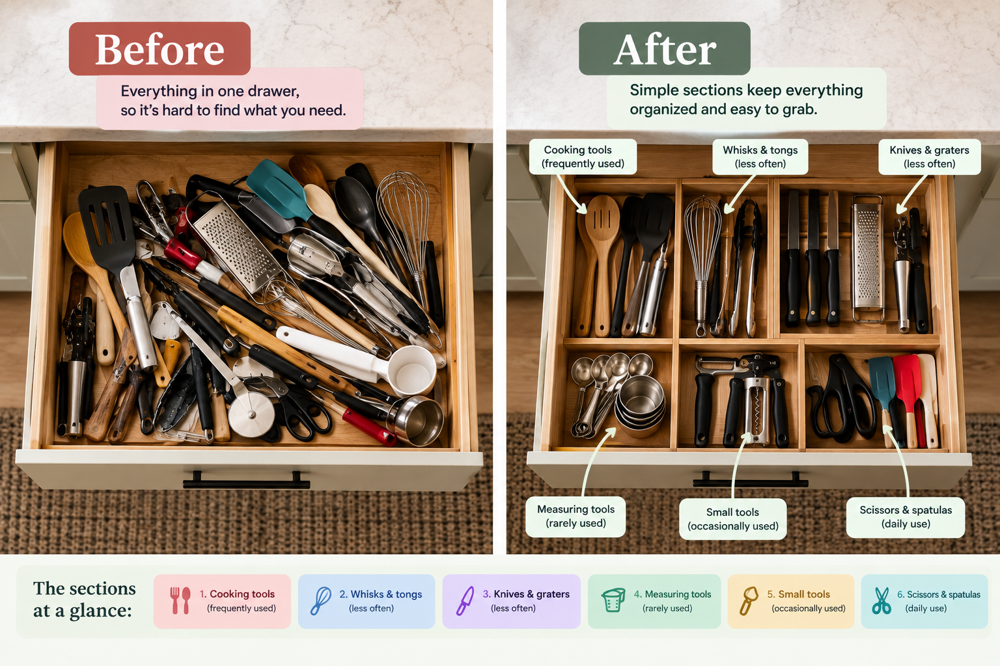
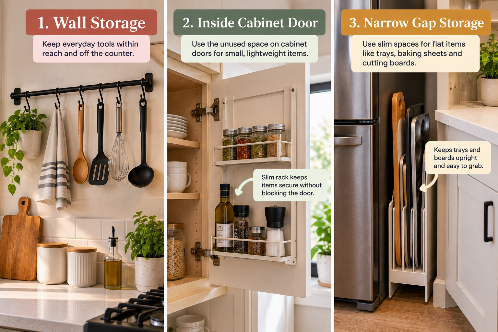
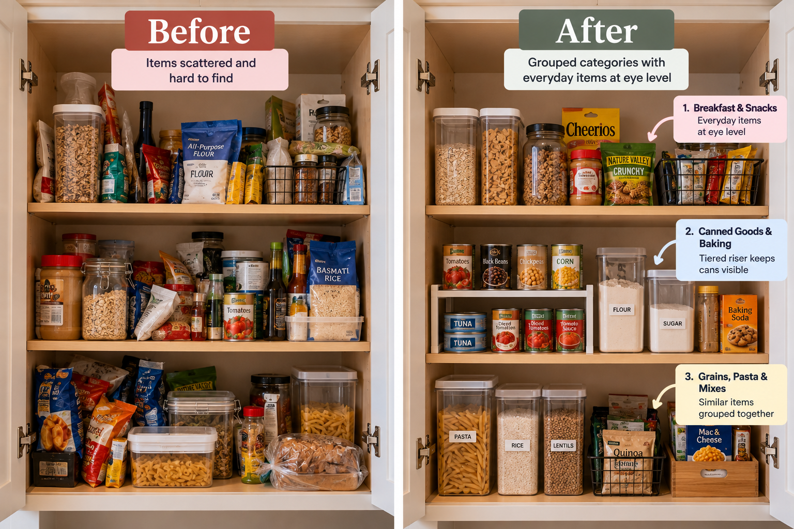
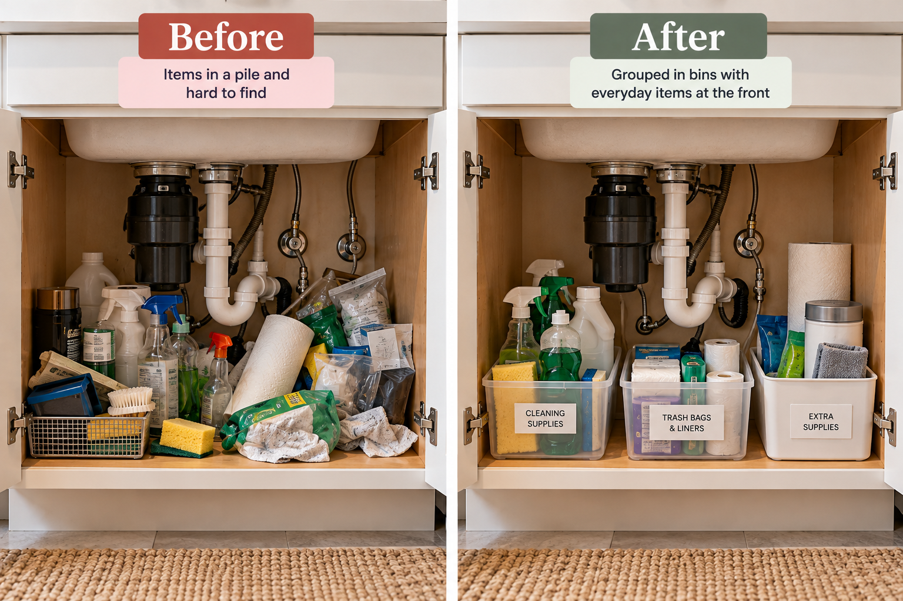
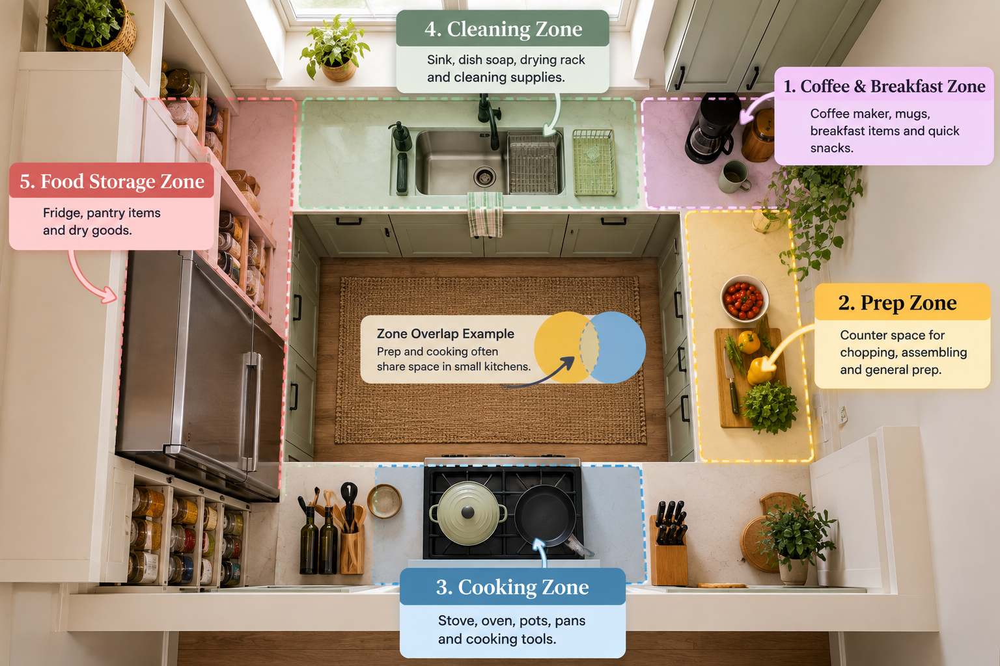
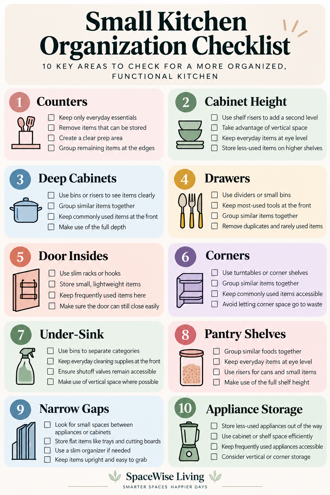

A kitchen can hold everything you own and still be hard to cook in. The pans fit, technically. So do the blender and the stack of containers. But the counter has turned into a shelf, the cabinet you open most is the one things fall out of, and the pot you use every night sits under two you haven't touched in months.

The usual response is to add storage: a rack, a caddy, a set of bins. Sometimes that helps. Often it puts one more object into a room that already has too many, because a shortage of containers was never the trouble.

This guide starts somewhere else. Adding storage and using space better are different jobs, and the second one comes first. So we'll begin with what you already have: where space is being lost, what's stored in the wrong spot, and how to set the kitchen up around the way you cook.

Storage products come last, and only where a real problem is left.

## Start by Finding Where Your Kitchen Is Actually Losing Space

Small kitchens rarely lose space in one obvious way. They lose it in a dozen small ones, and the pattern differs from home to home. So before moving anything, take five minutes to look.

### The 5-minute kitchen audit

Open every door and drawer and walk the room once. You're checking ten spots:

- **Counters:** what sits there only because nowhere else is convenient?
- **Cabinet height:** is there a hand's width of empty air above the stacks?
- **Deep cabinets:** what's in the back third, and when did you last see it?
- **Drawers:** has one become the place everything gets dropped?
- **Cabinet doors:** are the inside faces blank?
- **Corners:** what got pushed in and stayed?
- **Under the sink:** is it one pile around the pipes?
- **Pantry shelves:** can you see the back row without moving the front?
- **Narrow gaps:** is there one you could comfortably reach into?
- **Appliances:** is something you use twice a year on your best shelf?

Then note two things the cabinets won't show you: what you use every day, and which items keep ending up in the same "wrong" place. The second is the most useful. Olive oil that drifts to the stove no matter where you put it away is telling you where it should be stored.

A counter crowded with daily-use items won't be fixed by a drawer organizer. **Organization should follow the problem.**

## Clear the Countertops First

In a small kitchen the counter is the only work surface, so everything parked on it competes with the cutting board and the plate you're trying to set down.

Sort what's out by how often you use it:

- **Daily:** the kettle or coffee maker, the knife you reach for at every meal, dish soap. These stay.
- **Occasional:** a blender or stand mixer used weekly or a few times a month. These move to a cabinet you can reach without a stool.

* **Rare:** seasonal items and things you use only a few times a year. These go to the top shelf, the back of a deep cabinet, or a closet outside the kitchen.

Notice that the daily group stays put. An empty counter isn't the goal. If you make coffee every morning, lifting the machine out of a cabinet each day is a chore you'll drop within a week. What you're cutting down is the competition for a limited work surface.

Then there's everything that isn't kitchen equipment. Mail, keys, and chargers land on the counter because they have no home nearby. Give each one a specific place, even a modest one: a hook by the door, a small tray, a spot on a shelf.

Picture the difference. Before, the counter holds a dozen things and you prep dinner in the gaps between them. After, it holds four, grouped at the edges, with one clear stretch wide enough for a cutting board and a bowl. Nothing was thrown out. A few categories moved.

## Make Your Cabinets Work Harder

A cabinet with things in it isn't necessarily full. If there's open air above the stacks and things hidden behind other things, it's holding less than it could and making you dig for it.

### Use the height that's already there

Shelves are often spaced for the tallest thing anyone ever stored on them, so everything shorter leaves a band of empty space on top. Check first for adjustable shelves. Many cabinets have them, resting on pegs, and moving one up or down a notch can make room for a second row of glasses.

Where shelves are fixed, a shelf riser does a similar job. It's a small freestanding platform that splits one shelf into two levels, so plates sit below and bowls above instead of in one wobbly stack.

### Group by use, not only by type

Sorting by object (mugs with mugs, bowls with bowls) works for most things. Some are better grouped by what you do with them. Oats, cereal bowls, and tea can share a breakfast shelf. Flour, sugar, and measuring cups can share a baking one. The payoff is opening one door instead of four.

### Deal with the depth

Deep cabinets fail in a particular way: the front row is usable and the back row vanishes. Things get pushed back, forgotten, and bought again.

Start with placement, which is free. Everyday items go in front, and the things you need a few times a year go behind them. If that isn't enough, use a bin as a makeshift drawer: group related items in it and slide the whole thing out when you need something from the back.

Pull-out shelves and baskets go a step further by bringing the back of the cabinet to you. They can earn their place in a base cabinet you use constantly. They also have to fit the cabinet you have, hinges and frame edges included, and renters may not be able to install them. Plenty of kitchens never need one.

## Turn Kitchen Drawers Into Useful Storage

You look down into a drawer, so nothing hides behind anything else. That makes drawers some of the best storage in a small kitchen, as long as the contents aren't sliding into one heap.

A drawer needs a few useful categories. It doesn't need a grid. Something like:

- everyday cutlery
- stove tools: spatula, wooden spoon, tongs
- prep tools: peeler, grater, measuring spoons
- sharp things, kept apart
- wraps, bags, and clips

Put the few tools you use at nearly every meal at the front of the top drawer.

Dividers help keep categories from blending, but they're optional, and small boxes or containers you already own do the same job. If you buy any, measure the inside of the drawer first, height included.

The thing to avoid is over-organizing. When every tool has its own narrow slot, putting things away turns into a sorting exercise, and within a few weeks tools go wherever they fit. Four or five broad sections you can drop things into will hold up better. The test is simple: the new system should be easier to keep up than the mess it replaced.

## Use Vertical Space You're Currently Ignoring

Cabinets and drawers are the storage the kitchen came with. The surfaces around them usually hold nothing. Using them can help, but each one depends on your particular kitchen.

**Walls.** A rail with hooks, a magnetic knife strip, or a short shelf can take tools out of drawers and off the counter. Wall storage is always on display, so be choosy: hang what you use constantly and don't mind looking at. If you rent or can't drill, adhesive hooks can work for light items, though how well they hold depends on the wall surface and the weight.

**Inside cabinet doors.** A slim rack or a few hooks can hold lids, wraps, or measuring spoons. Clearance is the limit. Whatever you add has to fit between the door and what's on the shelves, so close the door slowly the first time and see what it hits. Keep the load light.

**Cabinet sides and tops.** The exposed end of a cabinet run can take hooks for towels and oven mitts, as long as it's out of the walkway. A gap between the cabinet tops and the ceiling can hold rarely used items in a closed bin. Be more careful above the fridge or microwave, which may need room to vent, and keep anything that can burn or melt away from the stove.

**Narrow gaps.** The space beside the fridge or between an appliance and the wall looks like free storage. Sometimes it is. Measure it, make sure you can reach in comfortably, and check that it isn't there for ventilation or next to a heat source. A gap that passes can hold a slim rolling cart or trays stored on edge. One that doesn't is better left alone.

## Give Your Pantry a Better System

"Pantry" here means wherever your food lives: a closet, one tall cabinet, or two shelves above the counter.

Start with broad categories: grains and pasta, cans, baking supplies, snacks, breakfast foods, oils and vinegars. Five or six groups you can remember are more useful than fifteen you can't, and they tell you at once where a new purchase belongs.

After that, most pantry frustration comes down to not being able to see what's there. A few fixes, none of which need new containers:

- Keep rows one or two deep where you can, taller things at the back.
- Turn labels outward.
- Put small loose packets, like seasoning sachets and tea bags, in one open box so they stop disappearing.
- Don't stack bags on bags. The bottom layer is where food gets forgotten.

A tiered riser can help with cans and spices by lifting the back rows into view.

As for decanting everything into matching jars: it looks orderly, and some people like seeing every ingredient at a glance. It's also a recurring chore, and nothing about a working pantry requires it. Containers make the most sense for foods that come in flimsy bags or that you buy in bulk, such as flour, rice, or lentils. A box of pasta that stands up fine can stay in its box. Matching is optional.

## Don't Waste the Space Under the Sink

The cabinet under the sink is hard to organize for reasons that have nothing to do with you. Pipes cut through the middle, a disposal or water filter may take up one side, and there's often no shelf. What's left is a tall, irregular space where everything ends up on the floor in a single layer.

Take everything out and sort it into everyday cleaning supplies, backups, cloths and sponges, bags, and whatever drifted in because the cabinet was there. That last group usually shrinks the most, and backups can often move to a closet or a high shelf.

Then build around the plumbing instead of fighting it:

- Everyday items go at the front, where you can grab them without kneeling.
- Each category gets one bin or caddy, so you lift out a group instead of knocking over bottles to reach the back.
- If the cabinet is tall, a stackable shelf or an organizer made to sit around pipes can add a second level. Measure the clear space on each side of the pipes before choosing one, because under-sink layouts differ a lot.

Whatever you set up, keep the water shutoff valves clear. You don't want to be emptying a cabinet during a leak. And if small children or pets are around, cleaning products need a latch or a higher home.

## Find a Better Home for Awkward Kitchen Items

Some things don't fit any category. They're flat, bulky, or oddly shaped, and they end up wedged wherever there's room.

**Cutting boards, baking sheets, and trays.** Stacked flat, the one you want is always at the bottom. Stand them on edge, like books. A narrow cabinet or one section of a base cabinet works, with a simple rack to keep them upright.

**Pots, pans, and lids.** Nest pots by size where the shapes allow, and keep your most-used pan on top or by itself. If your cookware's maker recommends a protector between stacked pans, use one. Lids are usually what turns the cabinet chaotic, and they're often easier to manage stored apart from the pots: filed on edge in a rack, a deep drawer, or a holder on the inside of a door.

**Bulky appliances.** Let frequency decide. A rice cooker you use four nights a week can stay on the counter, and it shouldn't be hidden just because a bare counter looks cleaner. A waffle iron that comes out on holidays can live up high or outside the kitchen. For the ones you're unsure about, a few questions help more than a rule. Do you remember the last time you used it? Does it have a clear occasional purpose? Would it be hard to replace? Is the space it takes worth keeping free?

**Reusable bags and water bottles.** Both multiply. Give the bags one container and keep the overflow by the door or in the car. Lay bottles on their sides in a bin, or stand them in a divided box, and keep out only the ones in rotation.

## Organize Your Kitchen Around How You Actually Use It

Everything so far has dealt with one spot at a time. Zones deal with the kitchen as a whole, and the idea is simple: **store things close to where you use them.**

A zone is the area where one kind of task happens, with the tools for it in arm's reach. Most kitchens have some version of five: coffee and breakfast, prep, cooking, cleaning, and food storage.

Take coffee as the example. The organized-looking answer is a "coffee station": a tray, matching canisters, a corner styled for it. But suppose your coffee maker sits at the far end of the counter because that's where the outlet is, the mugs are in a cabinet across the room, and the coffee is in the pantry. Every morning is three trips. A station wouldn't fix that. Moving the mugs and the coffee into whichever cabinet is nearest the machine would, even if that cabinet also holds the cooking oil.

That's the difference between organizing around how the kitchen is used and organizing around how a photo looks. Zones in a small kitchen will overlap, share shelves, and look unremarkable. They're working if you can do a routine task standing more or less in one place.

The same reasoning puts knives and cutting boards by your main stretch of counter, spatulas and oil by the stove, and dish soap and towels at the sink.

To find your own zones, make something ordinary, like your usual breakfast, and count how many times you cross the kitchen. Each crossing is a candidate for a move. The items you noticed drifting during the audit are another clue.

## Make Small-Kitchen Organization Easier to Maintain

A kitchen can be organized in an afternoon. Keeping it that way has less to do with discipline than with how easy the setup is to follow on a tired weeknight.

### Keep the reset small

A reset is a few minutes after the last meal of the day. Appliances that don't live on the counter go back, ingredients return to the pantry or fridge, and the counter gets cleared of anything not meant to stay. The point is to start tomorrow with a usable work surface.

### Treat recurring mess as feedback

This is the idea we'd most like you to take from this guide: **when the same area keeps getting messy, the problem may be the system rather than you.**

Say the same three things are back on the counter every evening. Before resolving to be tidier, ask:

- Is their storage spot too far from where they're used?
- Is it awkward to get to: too high, behind something, under a lid?
- Is it unclear which category they belong to, so there's no obvious place to put them?
- Are they used often enough to deserve easier access, or a place on the counter?

Each answer points to a change in the setup. Move the home closer. Swap a lidded box for an open one, or a drawer for a hook. Merge two fussy categories into one. Promote the item to the daily group.

The same reading applies elsewhere. A drawer that's a jumble two weeks after you sorted it probably has too many sections or too much in it. A cabinet where things fall out is overfilled. None of this calls for more effort from you. It calls for a setup that asks less.

## Small Kitchen Organization Mistakes to Avoid

Most of these have come up already, so briefly:

- **Buying organizers before you understand the problem.** You end up with a container looking for a use.
- **Filling every empty space.** With no slack, you move three things to reach one.
- **Choosing looks over access.** If a setup slows down daily tasks, it won't last.
- **Giving prime storage to rarely used items.** Everyday things get pushed onto the counter.
- **Building something too complicated.** The more rules, the sooner they're ignored.
- **Ignoring vertical space.** Half of each shelf stays empty.
- **Copying someone else's kitchen.** What suits a daily baker may be useless to someone who mostly reheats.

## A Simple Small-Kitchen Reset You Can Do This Weekend

You don't need to buy anything for this, and it doesn't have to happen in one go.

1. **Remove the obvious clutter.** Clear the counter down to daily-use items and pull out clear duplicates. Stick to easy decisions.
2. **Identify the problem areas.** Run the five-minute audit and pick the two or three spots that bother you most.
3. **Group items.** Empty one cabinet or drawer at a time and gather like with like.
4. **Reassign storage.** Decide what lives where by how you use it: coffee things near the coffee maker, cooking tools by the stove.
5. **Improve accessibility.** Bring everyday items to the front and to the shelves between waist and eye level.
6. **Use overlooked space where it makes sense.** Move a shelf, stand trays on edge, try a hook inside a door.
7. **Test before buying.** Live with the arrangement for a week or two. If one spot still doesn't work, measure it and choose an organizer for that problem.

If time is short, do steps 1 and 2 and leave the rest for another day.

## Small Kitchen Organization Quick Checklist

- Clear the counter of anything you don't use daily
- Give mail, keys, and chargers a defined home off the work surface
- Remove obvious duplicates
- Group items by how you use them
- Move shelves or add risers to use full cabinet height
- Keep everyday items at the front of deep cabinets
- Divide messy drawers into a few broad sections
- Store trays, boards, and lids on edge
- Use doors, walls, and gaps only where they're truly usable
- Sort the under-sink cabinet by category
- Set up zones for coffee, prep, cooking, cleaning, and food storage
- Give bulky appliances a home based on how often you use them
- Do a short reset at the end of the day
- Rethink any spot that keeps getting messy
- Identify the problem, and measure, before buying an organizer

## Small Kitchen Organization FAQs

### How do I organize a small kitchen with very little cabinet space?

Start by moving out what doesn't need to be in the cabinets. Rarely used cookware, backup supplies, and serving pieces can often move to a closet, utility shelf, or another storage area outside the kitchen. Then look beyond the cabinets: a wall rail, or a freestanding shelf or cart if you have the floor space.

### How do I keep the counter clear when I share the kitchen?

Agree on the short list of things that live on the counter. For everything else, simple and visible homes such as open bins and hooks work better than a setup only one person understands.

### Do I need to buy organizers to organize a small kitchen?

No. Most of the improvement comes from deciding what goes where. Boxes, jars, and trays you already own can stand in for dividers and bins while you test a layout. If a spot still doesn't work after a couple of weeks, an organizer chosen for that spot is worth considering.

## Work With the Kitchen You Have

A small kitchen doesn't necessarily need more storage. It needs storage that makes sense for the way the kitchen is used: the easy shelves given to everyday things, a counter clear enough to work on, and each item kept near the task it belongs to.

You don't have to do all of it at once. Pick the spot that annoys you most, work out what's going wrong there, and change that one thing. If it gets messy again, adjust the setup before you blame yourself.

A good system takes friction out of ordinary days. It shouldn't become one more thing to keep up. That rarely takes a bigger kitchen. It takes making the one you have work better.
